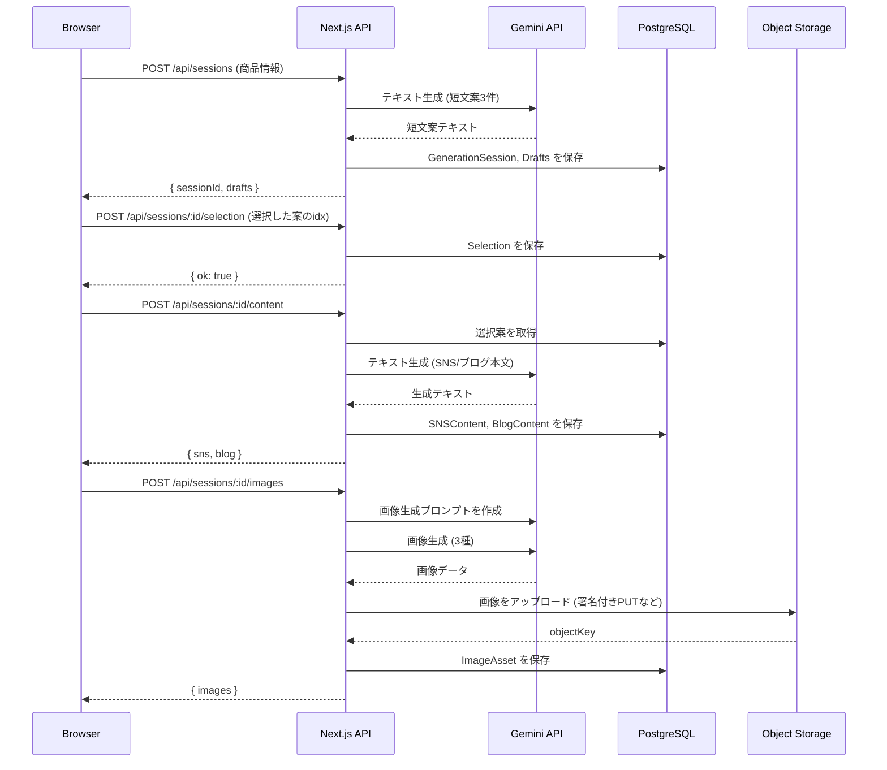

# 詳細設計書：SNS投稿＋ブログ＋背景画像を自動生成するWebツール

本ドキュメントは `基本設計書.md` に基づき、各機能の実装に必要な詳細仕様を定義する。

## 1. API詳細仕様

認証はAuth.jsによるセッションクッキーを前提とする。APIエンドポイントはすべて `/app/api/` 配下のNext.js Route Handlersとして実装する。

| #  | Method | Path                                | 役割 / 概要                   | Auth | 主なRequest Body (Zod Schema)                               | 主なResponse（200 OK）                                                                  |
| -- | ------ | ----------------------------------- | ------------------------- | ---- | ------------------------------------------------------- | ----------------------------------------------------------------------------------- |
| 1  | POST   | `/api/sessions`                     | 生成セッション開始＋短文案3件生成（Step1）  | 必須   | `{ productName: string, productImageUrl?: string, priceJpy?: number, buyUrl?: string }` | `{ sessionId: string, drafts: [{idx: number, text: string} ×3], status: "DRAFTS_READY" }` |
| 2  | POST   | `/api/sessions/:id/selection`       | 案の確定（Step2）               | 必須   | `{ selectedIdx: number }`                               | `{ sessionId: string, selection: {selectedIdx: number}, status: "DRAFTS_READY" }`      |
| 3  | POST   | `/api/sessions/:id/content`         | SNS/ブログ本文生成（Step3-テキスト）   | 必須   | `{ regenerate?: boolean }`                              | `{ sns: SnsContent, blog: BlogContent, status: "CONTENT_READY" }`                   |
| 4  | POST   | `/api/sessions/:id/images`          | 背景画像＆参考画像生成（Step3-画像）     | 必須   | `{ regenerate?: boolean }`                              | `{ images: ImageAsset[], status: "IMAGES_READY" }`                                  |
| 5  | GET    | `/api/sessions/:id`                 | セッション詳細取得（全結果）           | 必須   | -                                                       | `{ session, drafts, selection, sns, blog, images }`                                 |
| 6  | GET    | `/api/history?limit=10`             | 履歴一覧（最新10件）                | 必須   | -                                                       | `{ items: HistoryItem[] }`                                                          |
| 7  | POST   | `/api/history/:historyId/duplicate` | 履歴から再利用（新規セッション作成）        | 必須   | -                                                       | `{ newSessionId: string }`                                                          |
| 8  | DELETE | `/api/history/:historyId`           | 履歴削除                      | 必須   | -                                                       | `{ ok: true }`                                                                      |
| 9  | GET    | `/api/images/:imageId/download`     | 期限付き署名URLを発行             | 必須   | -                                                       | `{ url: string, expiresAt: string }`                                                |
| 10 | GET    | `/api/sessions/:id/events`          | SSEで進捗通知（任意実装）              | 必須   | -                                                       | SSE Stream: `event: progress, data: { status: SessionStatus }`                      |

### バリデーションルール (Zod)

- **POST /api/sessions**:
    ```ts
    import { z } from 'zod';

    const BodySchema = z.object({
      productName: z.string().min(1, "商品名は必須です").max(100),
      productImageUrl: z.string().url("有効なURLを入力してください").startsWith("https://", "httpsから始まるURLを入力してください").optional(),
      priceJpy: z.number().int().positive().max(10_000_000).optional(),
      buyUrl: z.string().url().startsWith("https").optional(),
    });
    ```
- **その他**:
    - URL入力はサーバーサイドで実際にフェッチし、MIMEタイプ（`image/*`）やサイズ（例: 5MB以下）を検証する。
    - 生成コンテンツの文字数や個数（ハッシュタグ等）は、DB保存前にサーバーサイドで再度バリデーションを行う。

### エラーレスポンス

| Status | Code | 説明 |
| --- | --- | --- |
| `400 Bad Request` | `VALIDATION_ERROR` | Zodによる入力検証失敗。`errors`フィールドに詳細を格納。 |
| `401 Unauthorized` | `UNAUTHENTICATED` | 認証されていないアクセス。 |
| `403 Forbidden` | `FORBIDDEN` | 権限のないリソースへのアクセス（例: 他人のセッション）。 |
| `429 Too Many Requests` | `RATE_LIMIT_EXCEEDED` | ユーザー単位のレート制限超過。 |
| `502 Bad Gateway` / `504 Gateway Timeout` | `AI_SERVICE_ERROR` | 下流のGemini APIでエラーまたはタイムアウトが発生。 |

## 2. データベース物理設計（Prismaスキーマ）

`要件定義書.md`で定義されたPrismaスキーマをそのまま物理設計として採用する。

```prisma
// schema.prisma
datasource db {
  provider = "postgresql"
  url      = env("DATABASE_URL")
}
generator client {
  provider = "prisma-client-js"
}

enum ImageKind {
  SNS_BACKGROUND
  BLOG_BACKGROUND
  REFERENCE
}

enum SessionStatus {
  CREATED
  DRAFTS_READY
  CONTENT_READY
  IMAGES_READY
  COMPLETED
  ERROR
}

model User {
  id        String   @id @default(cuid())
  email     String   @unique
  name      String?
  image     String?
  createdAt DateTime @default(now())
  updatedAt DateTime @updatedAt

  sessions  GenerationSession[]
  histories History[]
}

model GenerationSession {
  id          String        @id @default(cuid())
  user        User          @relation(fields: [userId], references: [id], onDelete: Cascade)
  userId      String
  productName       String
  productImageUrl   String?
  priceJpy          Int?
  buyUrl            String?
  systemPromptVer   String
  status       SessionStatus @default(CREATED)
  errorMessage String?
  drafts     Draft[]
  selection  Selection?
  sns        SNSContent?
  blog       BlogContent?
  images     ImageAsset[]
  createdAt  DateTime @default(now())
  updatedAt  DateTime @updatedAt
  @@index([userId, createdAt])
}

model Draft {
  id        String             @id @default(cuid())
  session   GenerationSession  @relation(fields: [sessionId], references: [id], onDelete: Cascade)
  sessionId String
  idx       Int
  text      String
  createdAt DateTime           @default(now())
  @@unique([sessionId, idx])
}

model Selection {
  id           String            @id @default(cuid())
  session      GenerationSession @relation(fields: [sessionId], references: [id], onDelete: Cascade)
  sessionId    String
  selectedIdx  Int
  draftId      String
  createdAt    DateTime          @default(now())
  @@unique([sessionId])
}

model SNSContent {
  id        String            @id @default(cuid())
  session   GenerationSession @relation(fields: [sessionId], references: [id], onDelete: Cascade)
  sessionId String
  title     String
  body      String
  hashtags  String[]
  bgImage   ImageAsset?       @relation("SnsBg", fields: [bgImageId], references: [id])
  bgImageId String?
  createdAt DateTime @default(now())
  updatedAt DateTime @updatedAt
}

model BlogContent {
  id        String            @id @default(cuid())
  session   GenerationSession @relation(fields: [sessionId], references: [id], onDelete: Cascade)
  sessionId String
  h1        String
  outline   Json
  bodyMd    String
  bgImage   ImageAsset?       @relation("BlogBg", fields: [bgImageId], references: [id])
  bgImageId String?
  createdAt DateTime @default(now())
  updatedAt DateTime @updatedAt
}

model ImageAsset {
  id        String            @id @default(cuid())
  session   GenerationSession @relation(fields: [sessionId], references: [id], onDelete: Cascade)
  sessionId String
  kind      ImageKind
  objectKey String
  mimeType  String
  width     Int
  height    Int
  prompt    String
  createdAt DateTime          @default(now())
  snsBg  SNSContent[] @relation("SnsBg")
  blogBg BlogContent[] @relation("BlogBg")
}

model History {
  id        String   @id @default(cuid())
  user      User     @relation(fields: [userId], references: [id], onDelete: Cascade)
  userId    String
  session   GenerationSession @relation(fields: [sessionId], references: [id], onDelete: Cascade)
  sessionId String
  title     String?
  pinned    Boolean  @default(false)
  createdAt DateTime @default(now())
  @@index([userId, createdAt])
}
```
**履歴10件制限ロジック**: `History`テーブルへの新規レコード追加後、同一`userId`を持つレコードのうち`pinned = false`のものを`createdAt`の昇順でソートし、総数が10件を超える分を削除するトランザクションをアプリケーション側で実行する。

## 3. 画面コンポーネント仕様

shadcn/uiをベースに、以下のコンポーネントを実装する。

- **`/dashboard`**:
    - `GenerationForm`: 商品名(`Input`)、画像URL(`Input`)、価格(`Input type="number"`)、購入場所URL(`Input`)の各フィールドと、「生成開始」(`Button`)を持つフォームコンポーネント。
    - `HistoryPreview`: 履歴ページのサマリー版をサイドバーなどに表示。

- **`/sessions/[id]/drafts`**:
    - `DraftCard`: 1つの短文案を表示するカード。テキスト、コピーボタン(`Button`)、「この案で進む」ボタン(`Button`)を含む。
    - `DraftList`: `DraftCard`を3つ横並び（モバイルでは縦積み）で表示するコンテナ。
    - `RegenerateButton`: 短文案を再生成するためのボタン。

- **`/sessions/[id]/result`**:
    - `SnsResultView`: SNS用のタイトル、本文、ハッシュタグを表示。各要素にコピーボタンを付与。
    - `BlogResultView`: ブログ用のH1、見出し構造、Markdown本文を表示。Markdownは`react-markdown`等でレンダリング。本文コピーボタンを付与。
    - `ImageResultView`: 生成された各画像（SNS背景、ブログ背景、参考）をプレビュー表示。ダウンロードボタン(`Button` or `<a>`)を付与。
    - `ResultTabs`: `SnsResultView`, `BlogResultView`, `ImageResultView`を切り替えるタブコンポーネント (`Tabs`)。

- **`/history`**:
    - `HistoryCard`: 過去の生成結果1件分のサマリー（タイトル、生成日など）を表示するカード。「再利用」「削除」ボタンを含む。
    - `HistoryList`: `HistoryCard`を一覧表示するコンテナ。

## 4. 主要シーケンス

**新規生成フロー（正常系）**



## 5. プロンプト設計

プロンプトはすべてサーバーサイドの定数としてバージョン管理される (`systemPromptVer`)。

- **System Prompt (v1.0.0)**:
    - 役割、出力形式、制約条件などを定義した共通プロンプト。サーバー内定数として保持。

- **Step 1: 短文案生成プロンプト**:
    - **入力**: `productName`, `productImageUrl`, `priceJpy`, `buyUrl`
    - **指示**: 上記の商品情報に基づき、ユーザーの興味を引き、感情に訴えかけるような80〜120文字のSNS投稿文案を3つ、JSON配列形式で生成してください。

- **Step 3: コンテンツ生成プロンプト**:
    - **入力**: Step 1のユーザー選択案
    - **指示**:
        1.  この案を基に、Instagram投稿用のタイトル（20字以内）、本文（100〜150字）、関連するハッシュタグを5個生成してください。
        2.  同じく、この案を拡張して、1200〜2000字程度のブログ記事を作成してください。H1、H2/H3からなる見出し構造（JSON形式）、およびMarkdown形式の本文を生成してください。

- **Step 3: 画像生成プロンプト**:
    - **指示**:
        - **SNS背景**: `[商品テーマ]`に合致する、テキストが乗せやすい抽象的でおしゃれな背景画像を1080x1080で生成。
        - **ブログ背景**: `[商品テーマ]`に合致する、クリックを誘うような魅力的なOGP画像を1200x630で生成。
        - **参考画像**: `[商品テーマ]`の`[商品名]`を使った、文字や商品写真が入った広告のような参考画像を生成。

## 6. テスト観点

- **単体テスト (Vitest)**:
    - バリデーションロジック（Zodスキーマ）の境界値テスト。
    - 履歴削除ロジック（10件制限、ピン留め考慮）のテスト。
    - APIごとのリクエスト・レスポンスの型テスト。
- **E2Eテスト (Playwright)**:
    - 新規ユーザー登録からコンテンツ生成、履歴確認までの一連のフロー。
    - URL入力欄に不正な値（http, 長すぎるURLなど）を入力した場合のエラー表示。
    - 画像生成に失敗した場合でも、テキストコンテンツは正常に表示されること（部分成功）。
    - コピーボタン、ダウンロードボタンが正常に機能すること。
    - レート制限を超えた場合に、適切なエラーメッセージが表示されること。
